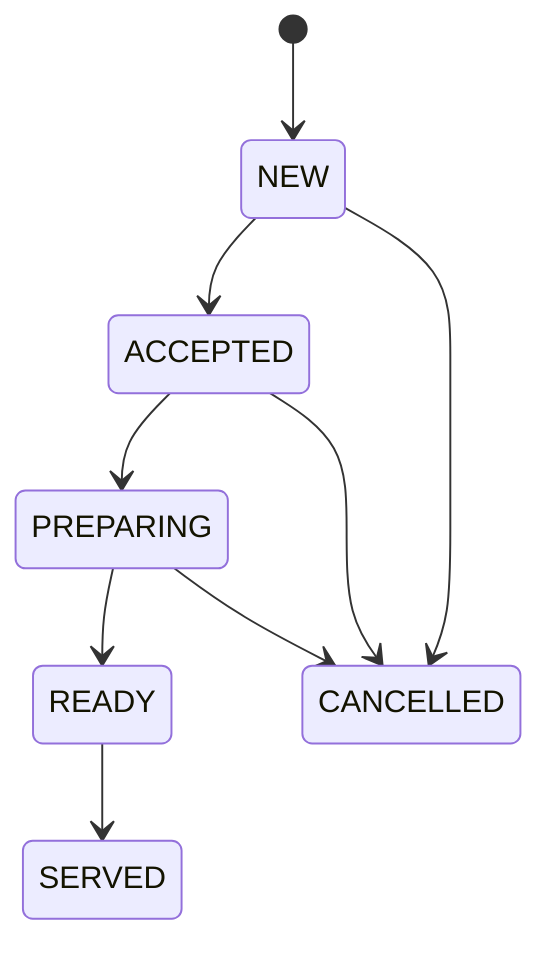

# API reference

All routes below are relative to `/api/v1`. Successful data responses use `{ "data": ... }`. The health route uses `{ "status": "ok", "version": "1.0.0" }`. Errors use `{ "error": { "message": "...", "requestId": "..." } }`, except rate-limit responses provided by middleware. Create returns 201, read/login 200 and updates without response content 204.

All mutation requests require `Origin: <PUBLIC_URL>`. Authenticated mutations also require `X-CSRF-Token`. Staff browser pages receive the token in a meta tag. Guest tokens come from their menu response. Cookies are HttpOnly and are managed by the browser. No Bearer JWT is used in this implementation.

Staff routes accept `X-Branch-ID` or `?branch=<uuid>`. The server checks that the selected branch is authorized. It never grants branch access based on the supplied identifier alone.

## Authentication

| Method | Path | Input |
| --- | --- | --- |
| POST | `/auth/login` | `{email, password}` |
| POST | `/auth/logout` | No body; requires session and CSRF |
| GET | `/me` | Current user and CSRF token |
| GET | `/health` | Unauthenticated readiness probe |

Staff sessions last eight hours. Guest sessions last twelve hours. Inactive users or paused businesses cannot authenticate. Existing staff sessions are rechecked on each request.

## Customer

| Method | Path | Behavior |
| --- | --- | --- |
| GET | `/public/menu/:token` | Resolve QR, set guest cookie, return venue, `session_id`, CSRF, categories and items |
| POST | `/public/orders` | Create or replay an order belonging to this guest |
| GET | `/public/orders` | Latest 30 orders for this guest session |
| GET | `/public/orders/:id` | One order owned by the guest |
| POST | `/public/requests` | `{kind: "WAITER"}` or `{kind: "BILL"}`; duplicate open requests reuse the existing record |

Example order body:

```json
{
  "expected_total": 38000,
  "items": [
    {
      "id": "a-real-menu-item-uuid",
      "quantity": 2,
      "modifiers": ["extra-sauce"],
      "notes": "Mild please"
    }
  ],
  "notes": "Bring water too"
}
```

Use actual item UUIDs returned by the menu endpoint. Submit an `Idempotency-Key` header containing a unique UUID. Save the exact body and key until the server acknowledges it. A replay with identical content returns 200 and `replayed: true`; first acceptance returns 201. A reused key with changed content returns 409. Unavailable dishes or stale totals return 409. An invalid or reassigned table context returns 410.

Example from a customer page on the application’s own origin:

```javascript
const key = crypto.randomUUID();
const response = await fetch('/api/v1/public/orders', {
  method: 'POST',
  headers: {
    'Content-Type': 'application/json',
    'X-CSRF-Token': document.querySelector('meta[name="csrf-token"]').content,
    'Idempotency-Key': key
  },
  body: JSON.stringify(orderBody)
});
const result = await response.json();
```

The application’s browser helper uses the latest CSRF token returned by menu refreshes. A network timeout is not proof that an order failed. Do not generate a new idempotency key for an uncertain retry.

## Staff orders

| Method | Path | Permission |
| --- | --- | --- |
| GET | `/orders` | All staff; oldest 100 active orders |
| GET | `/orders?closed=1` | All staff; latest 100 orders including completed/cancelled |
| PATCH | `/orders/:id/status` | State- and role-checked `{status}` |
| PATCH | `/orders/:id/payment` | Manager; records full cash payment |
| GET | `/requests` | All branch staff; open floor requests |
| PATCH | `/requests/:id` | All branch staff; completes a request |

Valid lifecycle:



Kitchen users may accept, prepare and mark ready. Waiters may mark ready orders served. Managers can perform all lifecycle actions and cancellation. A paid order cannot be cancelled through this MVP because no refund workflow is implemented.

## Manager configuration

| Method | Path | Input or result |
| --- | --- | --- |
| GET | `/branches` | Accessible branches |
| POST | `/branches` | `{name}`; adds to selected business |
| GET | `/menu` | Categories and menu items |
| POST | `/categories` | `{name}` |
| PATCH | `/categories/:id` | `{name}` |
| DELETE | `/categories/:id` | Empty categories only |
| POST | `/menu-items` | Full item input |
| PATCH | `/menu-items/:id` | Full item input |
| PATCH | `/menu-items/:id/availability` | `{available: boolean}` |
| GET | `/tables` | `{tables: [...], codes: [...]}` |
| POST | `/tables` | `{name}`; creates table and QR |
| PATCH | `/tables/:id` | `{name}`; renames the table |
| PATCH | `/qr-codes/:id` | `{active, table_id}`; maps inside selected branch |
| GET | `/qr-codes/:id.svg` | Actual scannable QR SVG |
| GET | `/staff` | Staff in selected branch and business managers |
| POST | `/staff` | `{name, email, password, role}` |
| PATCH | `/staff/:id` | `{active}`; revokes sessions |
| GET | `/reports` | Today’s statistics and top five dishes |
| GET | `/audit` | Latest 100 audit entries in selected branch |

Item input:

```json
{
  "name": "Charcoal chicken",
  "category_id": "a-real-category-uuid",
  "description": "Grilled chicken with vegetables and lemon.",
  "price": 18000,
  "available": true,
  "prep_minutes": 25,
  "image_url": "",
  "dietary": "",
  "modifiers": [{"id": "extra-sauce", "name": "Extra sauce", "price": 1000}]
}
```

Modifier IDs must be unique, lowercase alphanumeric strings with hyphens or underscores. Prices are integer TZS amounts. Modifiers are optional checkboxes in this MVP; required groups, size choices and per-group minimum/maximum counts are not implemented. Photo URLs can be HTTPS URLs, empty, or the bundled sample-image path.

## Platform

| Method | Path | Input or result |
| --- | --- | --- |
| GET | `/platform/businesses` | Businesses, status and branch counts |
| POST | `/platform/businesses` | `{name, branch_name}` |
| PATCH | `/platform/businesses/:id` | `{active}` |

Only the platform administrator may call these endpoints. Business creation is followed by selecting its branch and creating its manager account through `/staff`.

## Live connection

Connect to `/live?audience=staff&branch=<uuid>` or `/live?audience=customer` using the matching same-origin cookie. The server validates the WebSocket Origin and the branch/session. Events are invalidation notifications:

```json
{"type":"order.changed"}
```

Other types are `connected`, `menu.changed` and `service.changed`. Fetch the authorized REST endpoint after an event; notifications deliberately carry no order details. Customer order notifications are restricted to the owning guest. Menu changes reach all active clients in the branch. The UI retries the WebSocket with backoff and also refreshes every 20 seconds while visible.
