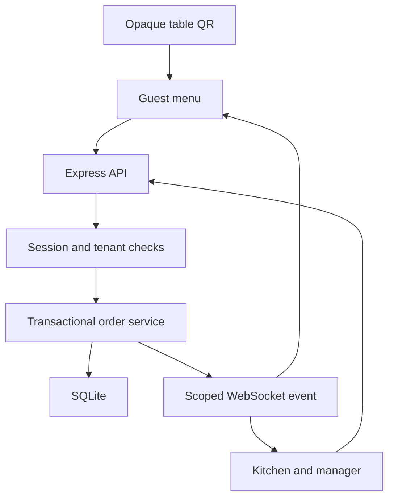

# Architecture and decisions

## Request path

EJS renders the page shell. Browser JavaScript fetches JSON for the active surface. The application remains one deployable server process with one database, so local setup is straightforward.

## Data ownership

Businesses own branches. Branches own tables, categories, menu items and orders. Staff users carry business and branch scope; platform administrators have explicit global access. Managers can select any branch of their own business, while kitchen and waiter accounts are limited to their assigned branch.

The database uses composite foreign keys for relationships where cross-branch mixing is especially dangerous: menu item/category, QR/table and order/table. Handlers derive business scope from the authenticated user and selected authorized branch. Public order creation derives its table and branch from a cookie-backed guest session.

An opaque QR token resolves to an active table and venue. A manager can reassign its table inside the branch without changing the public token. Old guest sessions cannot submit against the moved mapping. The token is 32 random bytes encoded as base64url.

## Stored records

| Table | Responsibility |
| --- | --- |
| businesses, branches | Tenant and location ownership |
| users, sessions | Staff identity, role, hashed session tokens and expiry |
| dining_tables, qr_tokens | Physical locations and stable public links |
| guests | Temporary table-bound customer sessions |
| categories, menu_items | Live menu, availability and validated modifier definitions |
| orders | Branch, table, guest, status, payment flag, total and idempotency identity |
| order_items | Immutable-at-API item and modifier price snapshots |
| order_events | Lifecycle history |
| service_requests | Waiter and bill requests |
| audit_logs | Append-only operational changes |

Modifier definitions and selected modifier snapshots are JSON inside their parent record in this MVP. Separate modifier-group tables can be introduced when required groups or shared option catalogs are needed.

## Money

The first release is single-currency TZS and uses integer shilling amounts. Line total is `(menu price + selected extras) * quantity`. The complete displayed total is compared with `expected_total` before acceptance. There are no hidden convenience fees, tax calculations, tips, discounts or currency conversions.

Ordered value and cash collected are distinct. A manager records a cash receipt; no payment provider is contacted. Status transitions do not automatically imply payment.

## Consistency and failure handling

`BEGIN IMMEDIATE` protects order numbering, idempotency lookup, price reads, line writes and the initial status event as one transaction. A failed line rolls back the complete order. The database unique constraint is the final duplicate guard. The idempotency request hash prevents accidentally reusing a key for changed content.

The order lifecycle permits only explicit transitions. Updates are serialized in a short transaction. Repeated or stale actions return 409. UI clients refetch state, and events are broadcast after commits.

A committed order can exist even if the response or live event is lost. Repeated POST with the original key recovers the response. REST refresh on WebSocket reconnect and the periodic polling fallback recover missed notifications. No order is held only in memory.

## Resource and operational limits

SQLite uses WAL mode, foreign keys and a five-second busy timeout. Database calls are synchronous. This keeps small transactions simple, but they share the Node event loop. Keep queries bounded, monitor latency and move heavy reports to a separate worker before increasing load.

Body size is limited to 64 KiB. An order allows up to 30 lines, 20 units per line, 12 optional modifiers per item and five active orders per guest session. Total order value is bounded. General API, login and guest mutations have rate limits. WebSockets have a 1 KiB payload limit, no per-message compression, a global 500-connection cap and an eight-connection cap per cookie header. These are pilot defaults, not measured capacity guarantees.

Each socket is authorized on connection and revalidated during a 30-second heartbeat. Live events only invalidate the relevant view and carry no sensitive order payload. There is no cross-process pub/sub. Run one process for this version.

## Deliberate MVP boundaries

The initial product ships the scan/menu/order/kitchen/status loop and the management operations needed to run it. This source does not pretend to offer completed mobile-money, billing, plan enforcement, scheduled menus, inventory, password-reset email or enterprise support systems.

Before adding a payment integration, introduce payment-attempt records, verified webhooks, provider transaction uniqueness and reconciliation. Preserve the independent order lifecycle. Never mark a payment successful from a client redirect or unverified browser response.

## Primary technical references

- [Node.js SQLite API](https://nodejs.org/api/sqlite.html): DatabaseSync and transaction execution.
- [Express 5 error handling](https://expressjs.com/en/guide/error-handling.html): propagation of asynchronous route errors.
- [ws documentation](https://github.com/websockets/ws): authenticated HTTP upgrades and heartbeats.
